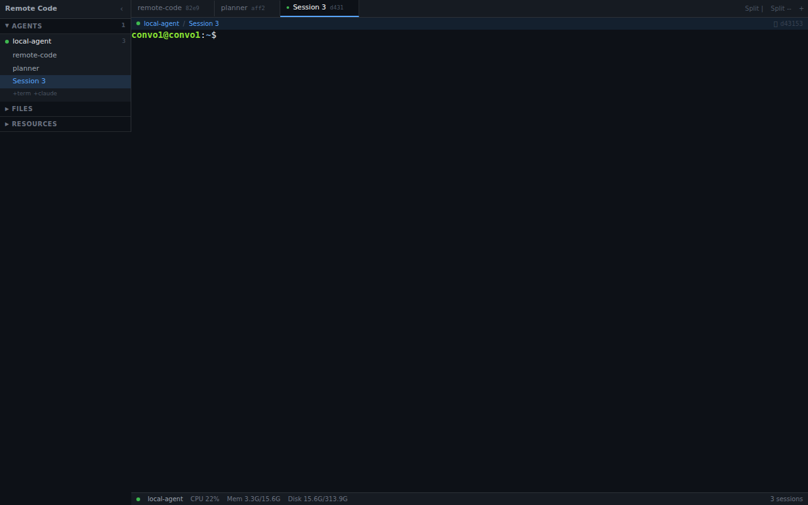
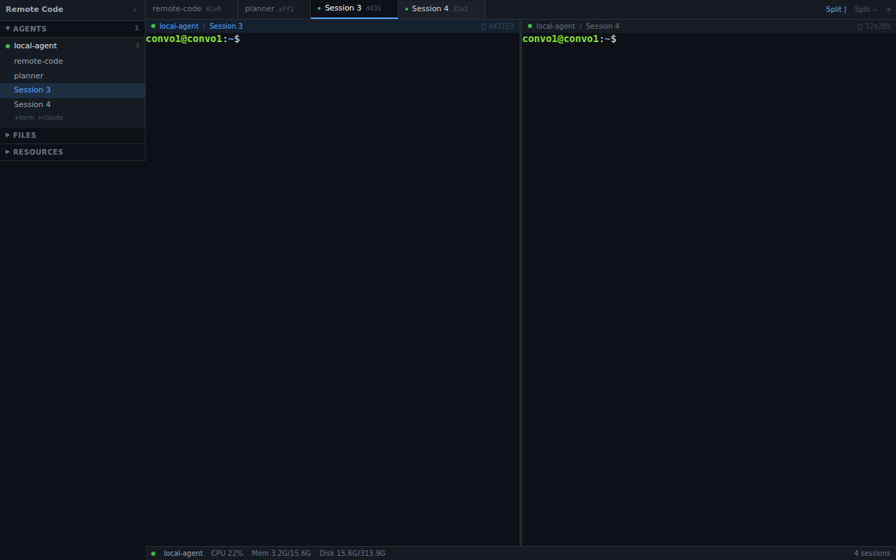
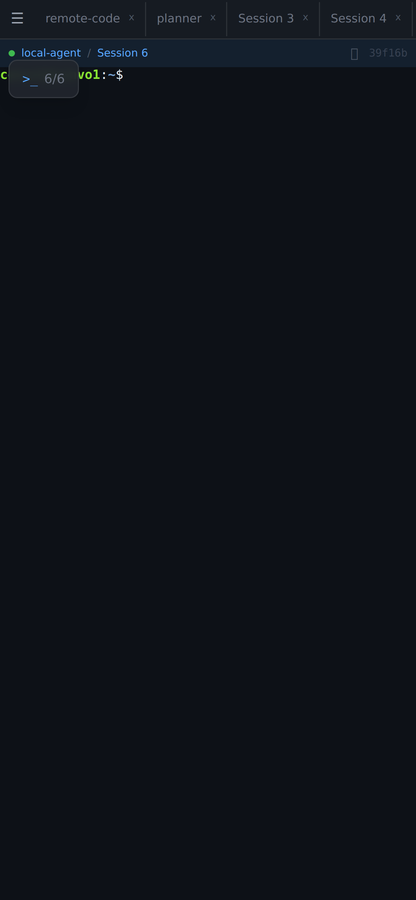

# Remote Code

Run AI coding agents across multiple machines from one browser tab.

Remote Code is an open-source terminal hub that lets you manage long-running terminal sessions across any number of remote machines. Spin up cloud VMs, install a lightweight agent, and orchestrate everything from a single web interface — desktop or mobile.



## Why

Running Claude Code, Codex, or other AI coding agents on remote machines today means juggling SSH connections, tmux sessions, and terminal tabs. Remote Code gives you:

- **One browser tab for all your machines** — no more switching between SSH windows
- **Sessions that survive everything** — close your browser, reboot your laptop, sessions keep running
- **Mobile access** — check on your agents from your phone with a full touch-optimized toolbar
- **Named sessions** — label what each agent is doing, find it instantly later

## Quick start

### 1. Start the hub

```bash
git clone https://github.com/ShardulAgg/remote-code.git
cd remote-code
npm install
npm run build:protocol
npm run dev:hub
```

The hub starts on `https://localhost:3000`. On first run it prints an admin token — save it.

### 2. Install an agent on any machine

```bash
sudo bash packages/agent/install.sh \
  --hub wss://your-hub-host:3000 \
  --token <your-token> \
  --name my-server
```

Or run in dev mode:

```bash
npx tsx packages/agent/src/index.ts \
  --hub wss://localhost:3000 \
  --token <your-token> \
  --name local
```

The agent connects to the hub and appears in the sidebar. That's it.

### 3. Open a terminal

Go to the hub in your browser, click `+term` or `+claude` next to any agent in the sidebar.

## Features

### Multi-node terminal workspace

Manage terminals across any number of machines from one place. The sidebar shows all connected agents with their sessions. Split the view to see multiple terminals side by side.



### Flexible split layout

Drag tabs onto terminal panes to split horizontally or vertically. Drag dividers to resize. Right-click for split options. Nested splits for any arrangement.

### Session persistence

Sessions survive browser disconnects, hub restarts, and network interruptions. The agent keeps PTY processes alive. The hub buffers scrollback so you see what happened while you were away.

### Named sessions

Double-click any tab to rename it. Names persist across refreshes in the database. Know at a glance what each agent is working on.


### Mobile optimized

Full terminal access from your phone with:

- Slide-out sidebar drawer
- Floating control toolbar with special keys (Ctrl+C, Tab, Esc, arrows)
- Terminal viewport scroll controls (Page Up/Down, Top/Bottom)
- Session switcher
- Image upload from camera roll
- Touch-optimized keyboard focus



### Image paste

Paste screenshots into terminals (Ctrl+V on desktop, camera button on mobile). The image is uploaded to the agent's filesystem and the path is typed into the terminal — useful for giving Claude Code visual context.

### Integrated sidebar

The sidebar combines:

- **Agents** — all connected nodes with their sessions
- **Files** — browse the filesystem of the active agent
- **Resources** — live CPU, memory, and disk usage per agent

### Status bar

Desktop status bar shows real-time resource usage for the active agent.

## Architecture

```
Browser ──WebSocket──> Hub ──WebSocket──> Agent 1 (PTY sessions)
                        │
                        ├──WebSocket──> Agent 2 (PTY sessions)
                        │
                        └──WebSocket──> Agent N (PTY sessions)
```

Three packages:

| Package | Description |
|---|---|
| `packages/hub` | Next.js web app + WebSocket server. Manages agents, proxies terminal I/O, stores sessions in SQLite. |
| `packages/agent` | Lightweight Node.js daemon. Spawns PTY sessions, reports stats, handles filesystem operations. Auto-reconnects. |
| `packages/protocol` | Shared TypeScript message types and encode/decode utilities. |

### How it works

1. **Agent** starts on a remote machine, connects outbound to the hub via WebSocket
2. **Hub** authenticates the agent, registers it, stores node info in SQLite
3. **Browser** connects to the hub, sees all agents and their sessions
4. **Terminal I/O** is proxied: browser &rarr; hub &rarr; agent PTY &rarr; hub &rarr; browser
5. **Sessions persist** on the agent even if the browser disconnects — reconnect anytime

## Configuration

### Hub

The hub uses environment variables or auto-detects:

| Setting | Default | Description |
|---|---|---|
| `PORT` | `3000` | HTTP/HTTPS server port |
| TLS | Auto (if `certs/` dir has `cert.pem` + `key.pem`) | Uses HTTPS if certs exist, HTTP otherwise |

### Agent

| Flag | Env var | Description |
|---|---|---|
| `--hub` | `HUB_URL` | Hub WebSocket URL |
| `--token` | `TOKEN` | Auth token from hub |
| `--name` | `NODE_NAME` | Display name (default: hostname) |
| `--id` | — | Override stable node ID |

### TLS with Let's Encrypt

```bash
sudo certbot certonly --standalone -d yourdomain.com
sudo cp /etc/letsencrypt/live/yourdomain.com/fullchain.pem packages/hub/certs/cert.pem
sudo cp /etc/letsencrypt/live/yourdomain.com/privkey.pem packages/hub/certs/key.pem
sudo chown $USER packages/hub/certs/*.pem
```

Restart the hub to pick up the new certs.

## Use cases

### Parallel AI coding agents

Spin up 4 cloud VMs, install agents, run Claude Code on each working on different tasks. Monitor all of them from one browser tab. Check progress from your phone.

### Self-hosted development servers

Turn your home lab machines into development nodes. Access them from anywhere via the browser without SSH keys or VPN setup.

### Team terminal access

Share the hub URL and token with your team. Everyone sees the same agents and can connect to sessions — useful for pair debugging or incident response.

## Self-hosted (free forever)

Install the hub and attach your own machines — unlimited nodes, unlimited sessions, no restrictions. Remote Code is fully open source.

## Tech stack

- **Frontend:** Next.js 14, React 18, Tailwind CSS, xterm.js
- **Backend:** Node.js, WebSocket (ws), better-sqlite3
- **Agent:** Node.js, node-pty
- **Protocol:** TypeScript, JSON over WebSocket

## Contributing

Remote Code is open source. Contributions welcome.

```bash
# Development
npm install
npm run build:protocol
npm run dev:hub          # Start hub on :3000
npm run dev:agent -- --hub wss://localhost:3000 --token <token>
```

## License

MIT
